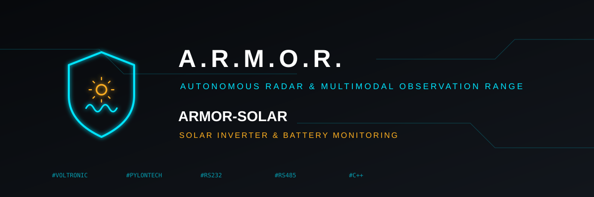

<p align="center">
  
</p>

# ☀️ ARMOR-SOLAR

<p align="center">
  <a href="README.md">🇺🇸 English</a> |
  <a href="README_spa.md">🇪🇸 Español</a> |
  🇫🇷 <b>Français</b> |
  <a href="README_ita.md">🇮🇹 Italiano</a> |
  <a href="README_deu.md">🇩🇪 Deutsch</a> |
  <a href="README_zho.md">🇨🇳 简体中文</a> |
  <a href="README_jpn.md">🇯🇵 日本語</a>
</p>

### Surveillance d'onduleurs et de batteries solaires : les protocoles série et les messages d'un nœud passerelle

<p align="center">
  
  
  
  
</p>

---

**Vérification d'honnêteté - ce qui fonctionne aujourd'hui:** **Maturité : scaffolding.** La bibliothèque de protocoles (100 contrôles) décode les onduleurs Voltronic / MPP Solar et la console Pylontech, cellule par cellule et avec les capacités, à partir de réponses typiques écrites à la main. Les messages qu'elle imprime sont validés par ARMOR-COMMON, lus par ARMOR-SERVER et affichés dans les menus Onduleurs et Batteries de Studio, le tout avec des relevés générés. **Aucun onduleur ni batterie n'a été connecté**, il n'y a pas encore de firmware de nœud, et ANT-BMS n'est pas décodé car son document de protocole n'est pas dans le projet.

---

## 🎯 Présentation

* **Onduleurs Voltronic / MPP Solar** (Axpert, PIP, InfiniSolar et clones), RS232 à 2400 bauds : les trames et leur CRC, et les relevés `QPIGS` (réseau, sortie, batterie, PV, bits d'état), `QMOD` (mode), `QPIWS` (avertissements et pannes par nom) et `QPIRI` (valeurs nominales). Seules les commandes de lecture peuvent être construites : un réglage change la façon dont la maison est alimentée.
* **Batteries Pylontech** (US2000, US3000, US5000) : le tableau `pwr` de la console (tension, courant, températures et état de charge de chaque module), `bat <n>` (tension et température de chaque cellule) et `info <n>` (modèle, capacité restante et totale, cycles), résumés en une pile avec sa capacité et son énergie totales, et la trame RS485 avec ses deux contrôles. Les formats sont écrits de mémoire de la console publique et peuvent varier selon les firmwares.
* **Les messages d'un nœud passerelle** (`armor/solar/<nœud>/<appareil>/state`, un par onduleur ou pile de batteries), définis dans ARMOR-COMMON avec schémas et vecteurs de conformité, sérialisés ici et vérifiés par un script.
* **La conception du reste :** quelle carte (Wi-Fi seul ou Ethernet avec PoE), comment câbler RS232 et RS485 en sécurité (conversion de niveaux et isolation) et l'ordre dans lequel les menus de Studio ont été construits.
* **Pas encore :** ANT-BMS, le firmware du nœud et l'onglet Android. Rien n'a été connecté à un appareil réel.

## 📂 Structure du dépôt

```text
ARMOR-SOLAR/
├── core/    voltronic.hpp, pylontech.hpp, solar_json.hpp, json.hpp
├── tests/   test_solar.cpp, emit_samples.cpp, check_samples.py
└── docs/    PROTOCOLS.md, NODE_HARDWARE.md, SOLAR_MESSAGES.md, STUDIO_MENUS.md
```

## 🛠️ Environnement de développement

```bash
cmake -S tests -B build/host && cmake --build build/host
build/host/test_solar                                # 100 checks, -Werror
build/host/emit_samples | python tests/check_samples.py   # the messages have the fields of contract version 0
```

## 🔗 Projets liés

**A.R.M.O.R.** (Autonomous Radar & Multimodal Observation Range) est un système de sécurité périmétrique composé de dépôts indépendants. Chacun a sa propre version, ses propres tests et son propre README ; voici la famille :

* **[ARMOR-COMMON](../ARMOR-COMMON)** - Contrats de messages, validateurs, vecteurs de conformité et types générés
* **[ARMOR-RADAR](../ARMOR-RADAR)** - Firmware du nœud de terrain pour ESP32-S3 avec trois radars et son propre panneau web
* **ARMOR-SOLAR** (ce dépôt) - Protocoles des onduleurs et batteries solaires et messages d'un nœud passerelle
* **[ARMOR-SERVER](../ARMOR-SERVER)** - Coordinateur central : télémétrie, alarmes, appareils, relevés solaires et caméras
* **[ARMOR-STUDIO](../ARMOR-STUDIO)** - Console web : caméras, radar, alarmes, énergie solaire et concepteur de site 2D/3D
* **[ARMOR-ANDROID-CONTROL](../ARMOR-ANDROID-CONTROL)** - Client Android de l'opérateur avec radar 2D/3D en direct
* **[ARMOR-SERVER-AI](../ARMOR-SERVER-AI)** - Politique d'inférence visuelle qui explique ses décisions et n'agit jamais
* **[ARMOR-VOICE-AI](../ARMOR-VOICE-AI)** - Intentions vocales hors ligne avec une confirmation impossible à falsifier
* **[ARMOR-HARDWARE](../ARMOR-HARDWARE)** - Boîtiers, électronique et matrice d'acceptation sur banc
* **[ARMOR-DEVOPS](../ARMOR-DEVOPS)** - Déploiement, banc d'essai CM5, sauvegarde et TLS
* **[ARMOR-SIMULATOR](../ARMOR-SIMULATOR)** - Simulateur de télémétrie hors ligne avec des pannes reproductibles
* **[ARMOR-DOCS](../ARMOR-DOCS)** - Architecture, base de sécurité et matrice des capacités

## 📚 Documentation et communauté

Pour en savoir plus :

* [Matrice des capacités : ce qui est prouvé et ce qui ne l'est pas](../ARMOR-DOCS/docs/CAPABILITY_MATRIX.md)
* [Catalogue des projets : versions et dépendances entre les dépôts](../ARMOR-DOCS/docs/PROJECT_CATALOG.md)
* [Historique des modifications de ce dépôt](CHANGELOG.md)
* [Licence (GPL-3.0-or-later)](LICENSE)
* Questions, idées et rapports : electrohobby3d@gmail.com

## 👤 AUTEUR

**JuanenRac (Electro Hobby 3D)** · electrohobby3d@gmail.com

## 📜 LICENCE

GPL-3.0-or-later - voir [LICENSE](LICENSE).
